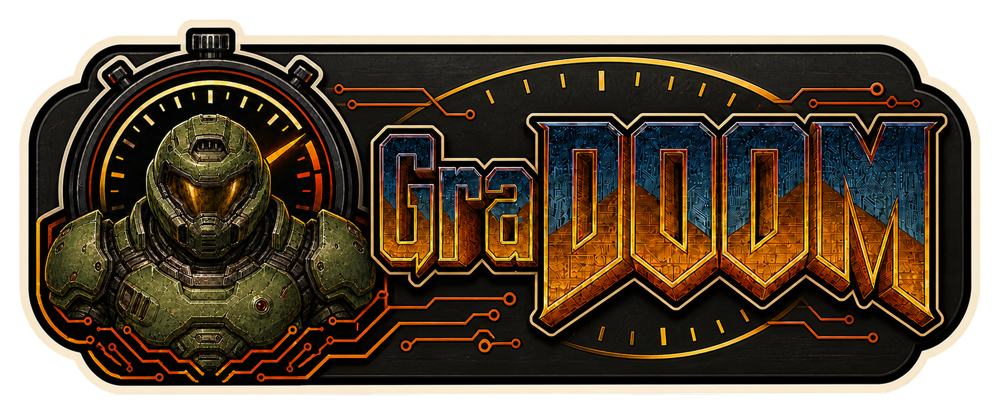
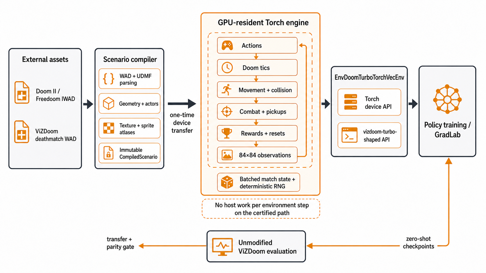

<div align="center">
  

  **🔥 Rip and Tear Until It Is Done—at GPU speed. 🔥**
</div>

GraDOOM is a Python library for reinforcement-learning researchers and engineers who need to train Doom policies at high throughput. It runs batched deathmatch simulation, rendering, rewards, and resets in PyTorch on the same device as the learner, then targets zero-shot evaluation in comparable ViZDoom environments.

Use `GraDoomVecEnv` with an operator-supplied Doom II or Freedoom IWAD and the pinned ViZDoom deathmatch scenario. The current alpha provides a device-tensor API, a `vizdoom-turbo`-shaped vector API, a scenario compiler, and a vectorized Torch execution model.

## Install

GraDOOM requires Python 3.11 or newer and [uv](https://docs.astral.sh/uv/).

```bash
git clone https://github.com/tsilva/GraDOOM.git
cd GraDOOM
uv sync --group dev
```

## Use

```python
import torch

from gradoom import GraDoomVecEnv

num_envs = 128
device = torch.device("cuda")
env = GraDoomVecEnv(
    scenario="/path/to/vizdoom/scenarios/deathmatch.wad",
    rom_path="/path/to/doom2.wad",
    num_envs=num_envs,
    device=device,
    compile_engine=True,
)

lanes = torch.arange(num_envs, device=device)
observations, signals = env.reset_device(
    torch.ones(num_envs, device=device, dtype=torch.bool),
    lanes + 1,
)
actions = lanes % env.single_action_space.n
transition = env.step_and_reset_device(actions, lanes + num_envs + 1)
raw_rgb_with_hud = env.render()  # 320x240 RGB24, no observation preprocessing
env.close()
```

`observations`, rewards, episode flags, and signals remain Torch tensors on the selected device.

## Commands

```bash
uv run pytest                                             # run the test suite
uv run ruff check .                                      # lint the repository
uv run python -m gradoom.inspect_scenario \
  --scenario /path/to/deathmatch.wad --iwad /path/to/doom2.wad  # inspect assets
uv run python tools/cuda_correctness_smoke.py --compile-engine   # check CUDA residency
```

## Notes

- GraDOOM is under active construction and is not yet parity-certified. No current release supports a public fastest-training claim.
- The first certification candidate is single-player `deathmatch-p1-v1`: 17 actions, frame skip 2, and 84×84 grayscale CHW observations with four-frame stacking.
- `render()` and `render_lane()` expose the unprocessed 320×240 RGB24 comparison view with the full Doom HUD; observation preprocessing remains separate from this diagnostic render path.
- The initial certification hardware target is one NVIDIA RTX 4090 integrated with GradLab.
- Pass asset paths directly or set `GRADOOM_IWAD` and `GRADOOM_DEATHMATCH_WAD`. WADs and other game data are not distributed with this repository.
- Torch tensors are the performance transport. NumPy transport is available only for CPU diagnostics and compatibility testing.
- Operator-run benchmarks require a controlled quiet window and matched reference evidence; see [deathmatch parity](./docs/deathmatch-parity.md).
- See [third-party notices](./THIRD_PARTY_NOTICES.md) for source and game-data policy.

## Architecture



## License

[MIT](./LICENSE)
